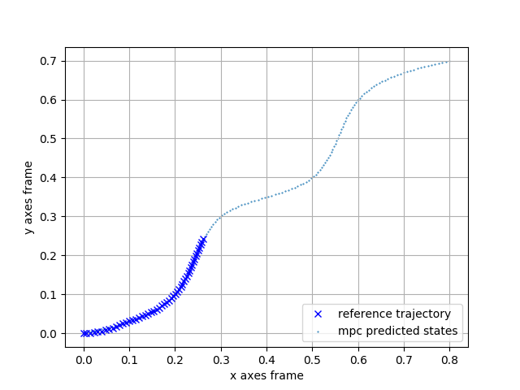

# model predictive control trajectory tracking application
This repository is an implementation of a pyhton/ros/casadi based mpc trajectory tracking application.

## Environments

- python 2.7(python 3.x should also work)
- Casadi 3.5.5
- numpy
- matplotlib
- bisect
- rospkg

## Installation

```
pip install -r requirements.txt
```

## Model Predictive Control Model
### Variables:
1.U: [v, omega]

2.X: [x, y, theta]

3.X_ref: [x, y, theta]

### multishooting method:
1.opt_variables: [U, X]

2.opt_parm: [X_ref]

## Main APIs:

### Spline2D
* create trajectory given current a set of goal points based on spline method [reference: python robotics](https://github.com/AtsushiSakai/PythonRobotics)
* args:
    * x: x axes of path planning points based on robot frame
    * y: y axes of path planning points based on robot frame

### forward
* generate nlp solver based on model predictive control model
* args:
    * T: sampling time
    * N: number of horizons
* return: solver


## Visualization


## Reference
* [python robotics](https://github.com/AtsushiSakai/PythonRobotics)

